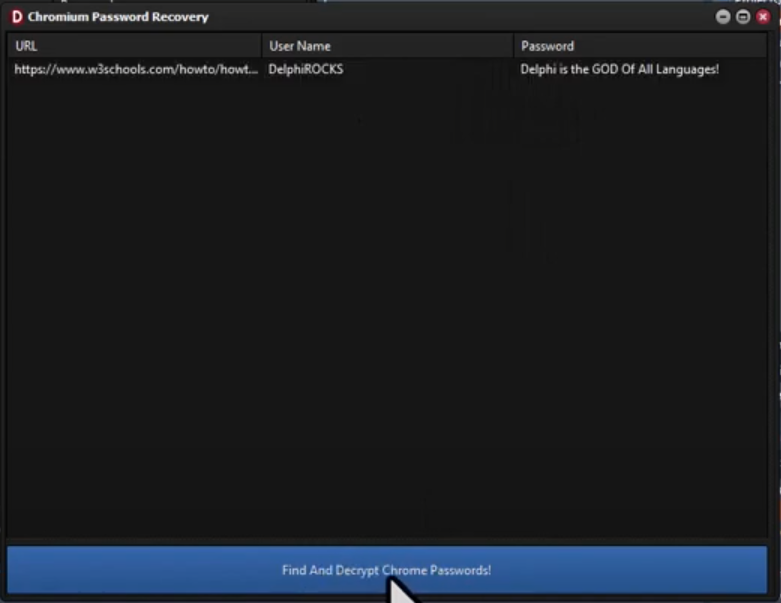

<h1>Chrome Password Recovery Tool</h1>

This Delphi application helps recover saved passwords from Google Chrome's profile data. It decrypts the encrypted passwords stored in Chrome for retrieval.

<!-- Replace 'Preview.png' with the path to your actual image file -->

  

<h2>Features</h2>
<ul>
  <li><strong>Recover Saved Passwords:</strong> Extract passwords stored in Chrome.</li>
  <li><strong>Decrypt Passwords:</strong> Decrypts encrypted passwords for access.</li>
  <li><strong>User-Friendly Interface:</strong> Simple and easy to use.</li>
</ul>

## Installation

1. **Install Required TMS Components:**
   - Open the Delphi IDE.
   - Click on **File -> Open...** and browse to the TMS Cryptography Suite components folder.
   - Look for two files named:
     - `TMSCryptoPkgDEDXE??.dproj`
     - `TMSCryptoPkgDXE??.dproj`
     - *(The "??" represents your Delphi IDE version number.)*
   - Open both files in the IDE simultaneously. (HOLD DOWN SHIFT and click on them both to ensure both are selected then click the OPEN button)
   - Compile the packages:
     - Click once to compile the package.
     - Right-click on the installable package and select **Install**.
   - Update the Library Path:
     - Go to **Tools -> Options...** and select **Library Path** for Win32.
     - Add the path to the components directory where the `.dproj` files are located.

2. **Open Delphi Project:** Open the `.dpr` file in the Delphi IDE.

3. **Compile:** Build the project to generate the executable.

4. **Run:** Execute the tool to start using it.

<h2>Usage</h2>
<ol>
  <li><strong>Launch the Application:</strong> Run the tool to automatically locate and scan the Chrome profile directory.</li>
  <li><strong>View Recovered Passwords:</strong> The passwords will be displayed within the application's interface.</li>
</ol>

<h2>Contributing</h2>

Contributions are welcome! If you have improvements or bug fixes, please fork the repository and submit a pull request.

<h2>License</h2>

This project is provided as is without warantee, use at your own risk!

## 📧 Contact

Discord: BitmasterXor

Made with ❤️ by: BitmasterXor and Friends, using Delphi RAD Studio

